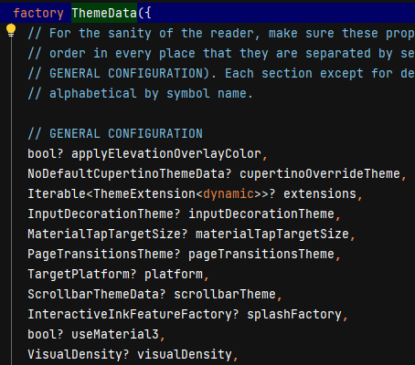
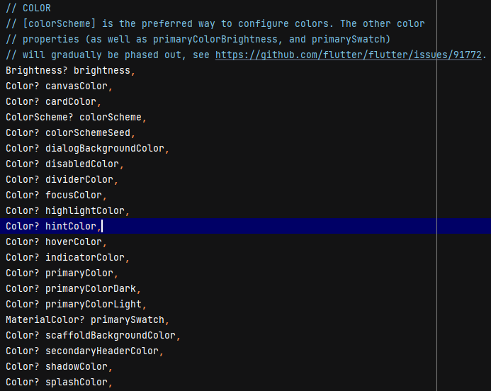
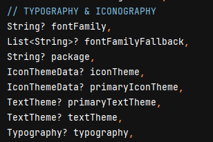
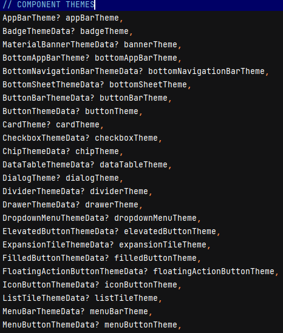
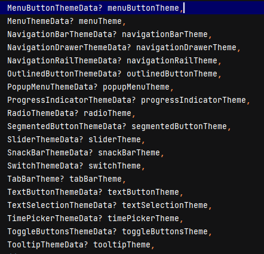
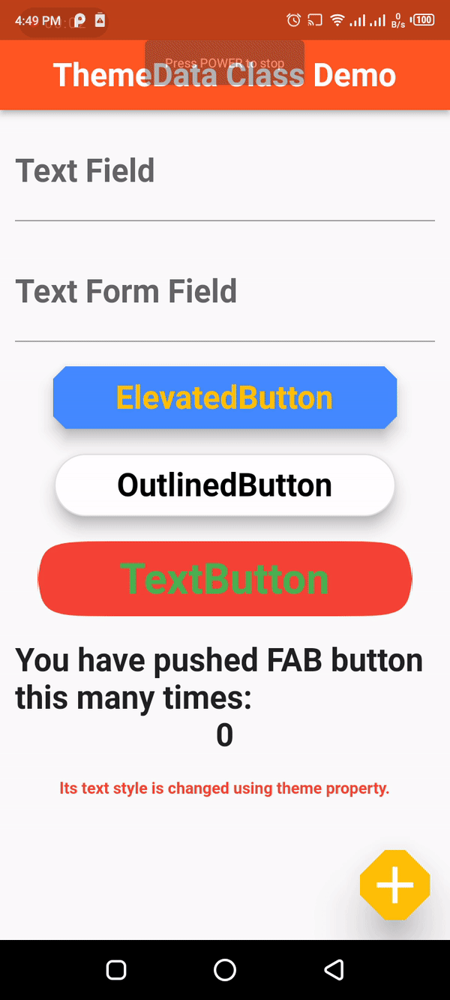

# themedata_class_flutter

A new Flutter project.

## Getting Started

This project is a starting point for a Flutter application.

A few resources to get you started if this is your first Flutter project:

- [Lab: Write your first Flutter app](https://docs.flutter.dev/get-started/codelab)
- [Cookbook: Useful Flutter samples](https://docs.flutter.dev/cookbook)

For help getting started with Flutter development, view the
[online documentation](https://docs.flutter.dev/), which offers tutorials,
samples, guidance on mobile development, and a full API reference.

## 1. Research: ThemeData Class in Flutter

- Keywords:
    - flutter themedata generator
    - flutter themedata(primaryswatch)
    - themedata flutter example
    - flutter themedata text color
    - themedata.dark flutter
    - flutter themedata color scheme
    - flutter custom themedata
    - flutter themedata secondary color
    - flutter themedata example
    - flutter themedata color scheme
    - flutter themedata light
    - flutter themedata secondary color
    - flutter primaryswatch example
    - flutter primaryswatch materialcolor
    - flutter theme extension
    - flutter theme text color
    - flutter text theme generator
    - flutter text theme
    - flutter themes
    - flutter themedata
- Video Title: Flutter ThemeData Class - ThemeData example with Themes, TextThemes, ButtonThemes and
  much more

## 2. Research: Competitors

**Flutter Videos/Articles**

- 103K: https://www.youtube.com/watch?v=oTvQDJOBXmM
- 1.3K: https://www.youtube.com/watch?v=vur8n5B8iWM
- 33K: https://www.youtube.com/watch?v=9iQiVUmLXyI
- 13K: https://www.youtube.com/watch?v=e9YBnPNKEAY
- 11k: https://www.youtube.com/watch?v=E8sUlKMrA-I
- 49K: https://www.youtube.com/watch?v=6YuQEVN6j-g
- 2.3K: https://www.youtube.com/watch?v=TkNG9I8g6iY
- https://api.flutter.dev/flutter/material/ThemeData-class.html
- https://docs.flutter.dev/cookbook/design/themes
- https://medium.com/@omlondhe/themedata-in-flutter-f6a67d9c636d
- https://www.digitalocean.com/community/tutorials/flutter-themes
- https://www.javatpoint.com/flutter-themes
- https://blog.logrocket.com/theming-your-app-flutter-guide/
- https://www.geeksforgeeks.org/flutter-themes/

**Android/Swift/React Videos**

- 23K: https://www.youtube.com/watch?v=DeyFygSs9Qc
- 29K: https://www.youtube.com/watch?v=ynOUzHFFMeg
- 9.2K: https://www.youtube.com/watch?v=4lcGfT4lGE8
- 1K: https://www.youtube.com/watch?v=bftIInmA0sE
- 2.4K: https://www.youtube.com/watch?v=xLcS1eoGJtc
- Playlist: https://www.youtube.com/watch?v=sAvs0itMqi0&list=PLtCBuHKmdxOd9kxsru5t_MFvDj5o5GdDl
- 11K: https://www.youtube.com/watch?v=jxeuC9AVQpk
- 3.1K: https://www.youtube.com/watch?v=xZcoieFsFV8
- 8.3K: https://www.youtube.com/watch?v=EfIHqvJraRQ
- 19K: https://www.youtube.com/watch?v=6BlFPa_MGNg
- 2.2K: https://www.youtube.com/watch?v=PUzPqfhkeDI
- https://developer.android.com/develop/ui/views/theming/themes
- https://www.tutorialspoint.com/android/android_styles_and_themes.htm
- https://data-flair.training/blogs/android-styles-and-themes/
- https://google-developer-training.github.io/android-developer-fundamentals-course-practicals/en/Unit%202/51_p_themes,_custom_styles,_drawables.html
- https://stuff.mit.edu/afs/sipb/project/android/docs/guide/topics/ui/themes.html
- https://www.tutlane.com/tutorial/android/android-styles-and-themes-with-examples
- https://aryamansharda.medium.com/app-theming-in-swift-64ee10947c9c
- https://makeschool.org/mediabook/oa/tutorials/build-a-tip-calculator-in-swift-4/theming/
- https://www.avanderlee.com/swift/dark-mode-support-ios/
- https://blog.openreplay.com/theming-react-native-applications-with-styled-components/
- https://www.npmjs.com/package/react-native-theming
- https://medium.com/supercharges-mobile-product-guide/reactive-styles-in-react-native-79a41fbdc404
- https://blog.logrocket.com/comprehensive-guide-dark-mode-react-native/

**Great Features**

- ThemeData class defines the configuration of the overall visual Theme for a MaterialApp or a
  widget subtree within the app.
- Find more features
  here [https://api.flutter.dev/flutter/material/ThemeData-class.html](https://api.flutter.dev/flutter/material/ThemeData-class.html)
  .

**Problems from Videos**

- Question: How can I set a shared ThemeData between light and dark themes?

Answer: If you want to modify a few items, you can use the copyWith constructor.
Check [this](https://stackoverflow.com/questions/71119378/shared-themedata-between-light-and-dark-themes)
.

- Question: How to use more than 3 themes in-app?

Answer: Follow
this [link](https://medium.flutterdevs.com/multi-theme-using-provider-in-flutter-cdb89bbde4e0).

**Problems from Flutter Stackoverflow**

- https://stackoverflow.com/questions/69739647/flutter-themedata
- https://stackoverflow.com/questions/70910005/which-one-of-the-properties-of-the-themedata-class-is-related-to-changing-the
- https://stackoverflow.com/questions/74300799/theme-themedata-flutter
- https://stackoverflow.com/questions/71101677/how-to-change-the-texttheme-in-the-themedata-class
- https://stackoverflow.com/questions/73116362/the-themedata-usematerial3-isnt-working-in-others-routes-or-class
- https://stackoverflow.com/questions/70590455/flutter-move-theme-themedata-to-a-separate-file
- https://stackoverflow.com/questions/67158199/how-i-can-isolate-all-design-elements-in-flutter-to-one-themedata-class-have
- https://stackoverflow.com/questions/74452460/how-to-apply-different-themes-to-parts-of-a-flutter-app
- https://stackoverflow.com/questions/74801501/flutter-how-to-safely-change-theme-after-awaiting-theme-data-from-an-api-in-a

## 3. Video Structure

**Main Points / Purpose Of Lesson**

1. In this video, you will learn how to use ThemeData class to use global styles and themes in your
   app.
2. There are many theming properties of ThemeData but I have used following famous in this project:
    - appBarTheme
    - textTheme
    - elevatedButtonTheme
    - outlinedButtonTheme
    - textButtonTheme
    - floatingActionButtonTheme
    - tooltipTheme
    - dialogTheme
    - snackBarTheme
3. All these themes and styles can be set in root widget MaterialApp and can be used anywhere in
   app.

**The Structured Main Content**

1. `home` property of `main.dart` calls the `HomePage` widget from `home_page.dart` class.
2. Some general rules:
    - For Text of body and TextField label, text style is defined in textTheme with bodyMedium and
      titleMedium:
    - `displaySmall` is used to to directly apply this style to any text widget. It is used in the
      last children of Column in HomePage widget.
3. `theme` property of `MaterialApp` widget accepts `ThemeData` widget. You can define all theming
   properties of app here. These properties are automatically applied to the corresponding fields
   automatically in app everywhere.

   
   
   
   
   

4. `styles.dart` contains styles of text:

```dart
import 'package:flutter/material.dart';

const bodyMediumStyle = TextStyle(
  fontSize: 30,
  fontWeight: FontWeight.bold,
);

const titleMediumStyle = TextStyle(
  fontSize: 30,
  fontWeight: FontWeight.bold,
  color: Colors.green,
);

const displaySmallStyle = TextStyle(
  fontSize: 15,
  fontWeight: FontWeight.bold,
  color: Colors.red,
);

const appBarTitleTextStyle = TextStyle(
  fontSize: 30,
  fontWeight: FontWeight.bold,
);

final elevatedButtonStyle = ElevatedButton.styleFrom(
  backgroundColor: Colors.blueAccent,
  foregroundColor: Colors.amber,
  shape: BeveledRectangleBorder(
    borderRadius: BorderRadius.circular(10),
  ),
  padding: const EdgeInsets.symmetric(
    vertical: 10,
    horizontal: 50,
  ),
  textStyle: const TextStyle(
    fontSize: 30,
    fontWeight: FontWeight.bold,
  ),
  elevation: 10,
  minimumSize: const Size(250, 50),
);

final outlinedButtonStyle = OutlinedButton.styleFrom(
  backgroundColor: Colors.white,
  foregroundColor: Colors.black,
  // shape: const CircleBorder(eccentricity: .9),
  shape: const RoundedRectangleBorder(
    borderRadius: BorderRadius.all(Radius.circular(50)),
  ),
  padding: const EdgeInsets.symmetric(
    vertical: 10,
    horizontal: 50,
  ),
  textStyle: const TextStyle(
    fontSize: 30,
    fontWeight: FontWeight.bold,
  ),
  elevation: 10,
  minimumSize: const Size(250, 50),
);

final textButtonStyle = TextButton.styleFrom(
  foregroundColor: Colors.green,
  backgroundColor: Colors.red,
  shape: ContinuousRectangleBorder(
    borderRadius: BorderRadius.circular(100),
  ),
  padding: const EdgeInsets.symmetric(
    vertical: 10,
    horizontal: 50,
  ),
  textStyle: const TextStyle(
    fontSize: 40,
    fontWeight: FontWeight.bold,
  ),
  elevation: 0,
  minimumSize: const Size(300, 50),
);

const dialogContentTextStyle = TextStyle(
  fontSize: 20,
  color: Colors.amber,
);

const dialogTitleTextStyle = TextStyle(
  fontSize: 30,
  fontWeight: FontWeight.bold,
  color: Colors.red,
);

const tooltipTextStyle = TextStyle(
  fontSize: 20,
  color: Colors.black,
);

```

5. `theme.dart` contains theming properties of app:

```dart
import 'package:flutter/material.dart';
import 'styles.dart';

final myTheme = ThemeData(
  primarySwatch: Colors.deepOrange,
  brightness: Brightness.light,
  appBarTheme: const AppBarTheme(
    centerTitle: true,
    titleTextStyle: appBarTitleTextStyle,
  ),
  textTheme: const TextTheme(
    // For text of body
    bodyMedium: bodyMediumStyle,
    // For text of TextField and TextFormField
    titleMedium: titleMediumStyle,
    // Customized text style
    displaySmall: displaySmallStyle,
  ),
  elevatedButtonTheme: ElevatedButtonThemeData(style: elevatedButtonStyle),
  outlinedButtonTheme: OutlinedButtonThemeData(style: outlinedButtonStyle),
  textButtonTheme: TextButtonThemeData(style: textButtonStyle),
  floatingActionButtonTheme: FloatingActionButtonThemeData(
    shape: BeveledRectangleBorder(
      borderRadius: BorderRadius.circular(20),
    ),
    iconSize: 50,
    elevation: 30,
    backgroundColor: Colors.amber,
  ),
  tooltipTheme: TooltipThemeData(
    textStyle: tooltipTextStyle,
    decoration: BoxDecoration(
      color: Colors.grey[500],
      shape: BoxShape.rectangle,
      borderRadius: BorderRadius.circular(10),
    ),
  ),
  dialogTheme: DialogTheme(
    titleTextStyle: dialogTitleTextStyle,
    contentTextStyle: dialogContentTextStyle,
    shape: RoundedRectangleBorder(
      borderRadius: BorderRadius.circular(30),
    ),
  ),
  snackBarTheme: const SnackBarThemeData(
    backgroundColor: Colors.blueGrey,
    actionTextColor: Colors.amber,
    contentTextStyle: TextStyle(fontSize: 30),
  ),
);
```

6. `home_page.dart` class contains TextField, TextFormField, ElevatedButton, OutlinedButton,
   TextButton, bodyText, and FloatingActionButton respectively.

   

   Code:

```dart
import 'package:flutter/material.dart';

class HomePage extends StatefulWidget {
  const HomePage({super.key, required this.title});

  final String title;

  @override
  State<HomePage> createState() => _HomePageState();
}

class _HomePageState extends State<HomePage> {
  int counter = 0;

  void incrementCounter() {
    setState(() {
      counter++;
    });
  }

  final textFieldController = TextEditingController();
  final textFormFieldController = TextEditingController();

  @override
  void dispose() {
    textFieldController.dispose();
    textFormFieldController.dispose();
    super.dispose();
  }

  @override
  Widget build(BuildContext context) =>
      Scaffold(
        appBar: AppBar(
          title: Text(widget.title),
        ),
        body: SingleChildScrollView(
          child: Padding(
            padding: const EdgeInsets.all(12.0),
            child: Column(
              children: [
                TextField(
                  controller: textFieldController,
                  decoration: const InputDecoration(
                    label: Text('Text Field'),
                  ),
                ),
                const SizedBox(height: 20),
                TextFormField(
                  controller: textFormFieldController,
                  decoration: const InputDecoration(
                    label: Text('Text Form Field'),
                  ),
                ),
                const SizedBox(height: 20),
                ElevatedButton(
                  onPressed: () => showMyDialog(context),
                  child: const Text('ElevatedButton'),
                ),
                const SizedBox(height: 20),
                OutlinedButton(
                  onPressed: () {
                    final snackBar = SnackBar(
                      content: const Text('Yay! A SnackBar!'),
                      action: SnackBarAction(
                        label: 'Undo',
                        onPressed: () =>
                            ScaffoldMessenger.of(context).clearSnackBars(),
                      ),
                    );
                    ScaffoldMessenger.of(context).showSnackBar(snackBar);
                  },
                  child: const Text('OutlinedButton'),
                ),
                const SizedBox(height: 20),
                TextButton(
                  onPressed: () {},
                  child: const Text('TextButton'),
                ),
                const SizedBox(height: 20),
                const Text(
                  'You have pushed FAB button this many times:',
                ),
                Text('$counter'),
                const SizedBox(height: 20),
                Text(
                  'Its text style is changed using theme property.',
                  style: Theme
                      .of(context)
                      .textTheme
                      .displaySmall,
                ),
              ],
            ),
          ),
        ),
        floatingActionButton: FloatingActionButton(
          onPressed: incrementCounter,
          tooltip: 'Increment',
          child: const Icon(Icons.add),
        ),
      );
}

Future<void> showMyDialog(context) async {
  return showDialog<void>(
    context: context,
    builder: (BuildContext context) =>
        AlertDialog(
          title: const Text('AlertDialog Title'),
          content: SingleChildScrollView(
            child: ListBody(
              children: const [
                Text('This is a demo alert dialog.'),
                Text('Would you like to approve of this message?'),
              ],
            ),
          ),
          actions: [
            TextButton(
              child: const Text('Approve'),
              onPressed: () => Navigator.of(context).pop(),
            ),
          ],
        ),
  );
}

```